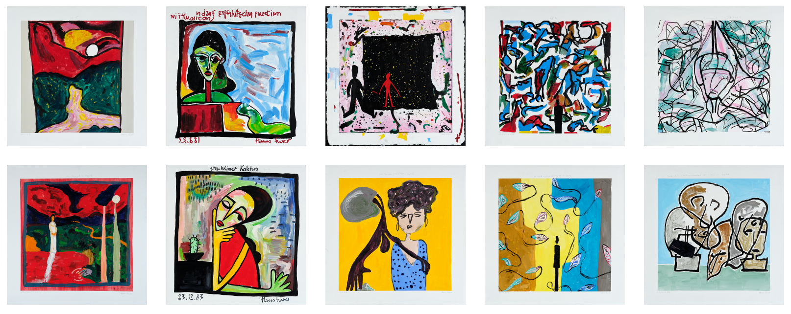
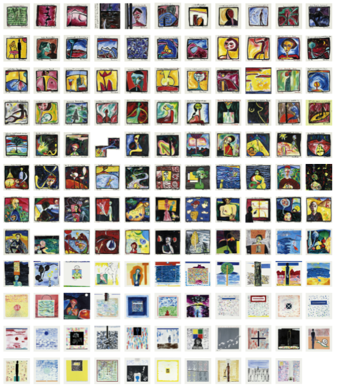
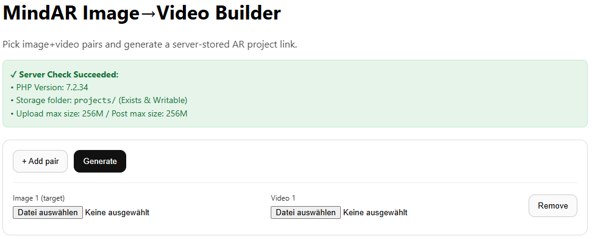
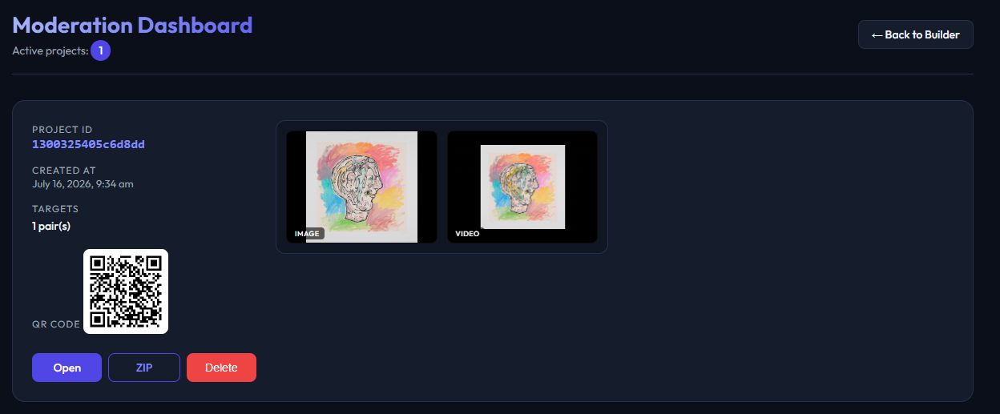

# AI-Experiment: an augmented reality art project co-created with artificial intelligence

This repository contains the official implementation of the image generation and augmented reality app, as well as a subset of the training data for the paper titles *AI-Experiment: an augmented reality art project co-created with artificial intelligence* which was published at the AI for Visual Arts Workshop (AI4VA) at European Conference on Computer Vision (ECCV)

[Bernhard Egger](https://eggerbernhard.ch/),
[Hans Furer](https://hansfurer.com/)

The following image shows the 5 artworks generated in this project in the top row. Each image is paired with a representative example from the training data (bottom row) from the same decade.



The images above can be experienced in Augmented Reality. For this, please take your phone and scan the QR code and then "scan" above images. The underlying app is based on html and javascript and can be run on any webserver. The webapp was developed with assistance of Gemini.

 

Together with the code in this repository to generate artwork like this, we release a subset of the training data, namely the images of Hans Furer from 1981-1990 under the CC-BY-NC license.



In addition to the simple app that shows the video above we built a small tool that enables to build your own AR experience based on images and corresponding videos. The following two tools need a webserver that runs php, both of them were built using antigravity and Gemini.



For a setting were different users are generating their AR apps we also provide a simple moderation tool (which does not incorporate password protection, which should be added via .htaccess).




## 🎓 Citation
```
@inproceedings{Egger2026ARTimate,
    title={AI-Experiment: an augmented reality art project co-created with artificial intelligence},
    author={Egger, Bernhard and Furer, Hans},
    booktitle = {AI for Visual Arts Workshop (AI4VA), European Conference on Computer Vision (ECCV)},
    year={2026}
}
```

## 🙌 Acknowledgements

This template was adapted from Andreea Ardelean - thank you

- [Gen3DSR: Generalizable 3D Scene Reconstruction via Divide and Conquer from a Single View]([https://github.com/dreamgaussian/dreamgaussian](https://github.com/AndreeaDogaru/Gen3DSR))


## 📝 License

The Jupyter Notebook for the Dreambooth fine-tuning and artwork generation is released under Apache 2.0 License
All own code and data is released under the CC BY NC4.0 [LICENSE](LICENSE).
